## Welcome to My WebGL Learning

> Threejs学习文档指引：[Threejs Learning](/ThreejsDemo)

### 概述

> 本文档主要用于`自我知识点检测`和`查阅`的，非教学向，亦可当做是《WebGL Programming Guide》的读书笔记, 并且由于篇幅有限，内容根据我自身情况进行概括总结。

> 由于本人是WebGL初学者，项目中的章节例子基本上的都参照[WebGL Programming Guide](https://www.amazon.com/WebGL-Programming-Guide-Interactive-Graphics/dp/0321902920?tag=realtimerenderin&pldnSite=1) 上面的例子进行模仿练习的，主体框架代码则是本人自己组织。如果有侵权问题，请提交Issue提醒我删除或更改。（If there is any infringement, please submit it to issue. I will delete or change it.）

> 如果有图形学学者想了解WebGL, 强烈推荐看WebGL Programming Guide一书；如果是前端开发者，建议先了解图形学的相关基本知识，再看这边书会有更深一层的认识。本人在看这边书之前有学过OpenGL，因此该书可以带领我快速入门WebGL, 毕竟万变不离其宗。但是如果是想深入了解WebGL, 个人并不推荐，该书的内容深度不够，
推荐看[Professional WebGL Programming](https://www.amazon.com/Professional-WebGL-Programming-Developing-Graphics/dp/1119968860)

> 本人阅读的是英文版，因此会摘录书中的一些图文内容用于参考，其内容不会做详细翻译解释。另外文档写完后有对照过中文版进行添加和修改，若文档中有哪些错误，欢迎大家提交Issue指正。


### WebGL开发的基本流程

* 获取DOM中的canvas元素，向该元素获取WebGL绘图上下文(开发时可开启调试模式)

* 如有应用shader，则需要加载vertexShader和fragmentShader(本项目的示例中采用加载文件中的字符串的形式)

> 虽然有效分离了代码，但是留下了需要加载文件的弊端（页面加载时间长），经过Threejs框架的参考，可仿照该框架放置shader的方式，【待引用】
  
* 设置canvas背景色 `gl.clearColor(r, g, b, a)`, 方法继承自OpenGL

* 清除canvas `gl.clear(buffer)`, 实质清空各种缓冲区, 方法继承自OpenGL, 顶替多种的基本缓冲区; 若没有指定背景色，则参考：
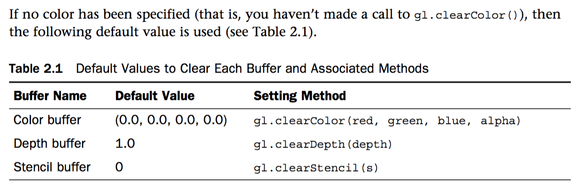

* 绘制操作 `gl.drawArray(mode, first, count)`, 该方法非常强大，可根据不同的模式和顶点数来指定绘制各种各样的图形

<b>下面补充完成创建和初始化shader的整个流程</b>

shader初始化流程（基本上与OpenGL一致）：
1. 创建shader
2. 给shader对象设置源码
3. 编译shader
4. 创建shader程序对象
5. 绑定编译完成的shader对象至程序
6. 链接程序对象
7. 使用程序对象

示例代码：
```javascript
  // 根据shader类型创建shader对象
  var shader = gl.createShader(type);
  //...
  // 将源码设置至shader对象中
  gl.shaderSource(shader, source);
  //...
  // 让显卡对shader进行编译
  gl.compileShader(shader);
  // 可以监听shader的编译结果，shader的编写很容易出错，必须要有这一步才方便查错
  var compiled = gl.getShaderParameter(shader, gl.COMPILE_STATUS);
  if (!compiled) {
    var error = gl.getShaderInfoLog(shader);
    console.log('Failed to compile shader: ' + error);
    gl.deleteShader(shader); // 没有编译完成则删除内存中的shader对象
  }
  //...
  // 创建程序对象
  var program = gl.createProgram();
  // 将编译好的vs对象和fs对象绑定至程序上
  gl.attachShader(program, vertexShader);
  gl.attachShader(program, fragmentShader);
  // 链接程序
  gl.linkProgram(program);
  // 同样也要监听链接结果
  var linked = gl.getProgramParameter(program, gl.LINK_STATUS);
  if (!linked) {
    var error = gl.getProgramInfoLog(program);
    console.log('Failed to link program: ' + error);
    gl.deleteProgram(program);
    gl.deleteShader(fragmentShader);
    gl.deleteShader(vertexShader);
  }
  // 最后则直接使用当前程序
  gl.useProgram(program);
  gl.program = program; // 这里是方便外部调用
```
  
接下来是获取程序当中的变量(如attribute，uniform),其变量会对应上显卡中核中的插槽，插槽的排列是从0开始的，opengl会把变量与插槽对应上
例如：attribute会与对应该种变量的0号插槽，uniform就会对应uniform变量中的0~2号插槽，因此要设置这些变量即是告诉GPU哪个插槽放哪个数据。

示例:

```javascript
  // attribute
  var a_Position = gl.getAttribLocation(gl.program, 'a_Position');
  gl.vertexAttrib3f(a_Position, 0.0, 0.0, 0.0);
  // uniform
  var u_MVPMatrix = gl.getUniformLocation(gl.program, 'u_MVPMatrix');
  var mvpMatrix = new Matrix4();
  gl.uniformMatrix4fv(u_MVPMatrix, false, mvpMatrix.elements);
```

完整的参考Demo: [example](https://zdawning.github.io/MyLearnWebGL/WebGLDemo/chapter02/point.html)

### WebGL的坐标系统

与OpenGL相同，使用的都是笛卡尔坐标系，默认情况下都是使用右手坐标系
我们屏幕前的webgl绘图区的可见的所有顶点都称作标准化设备坐标(NDC)，顶点范围在（-1, 1）的区间内，其外的范围都为不可见
当NDC坐标传入光栅器中时，则转变成屏幕上的二维坐标所对应的像素

这里顺便理清重要的5个坐标系统，是图形开发中基础的重要知识点。
* 物体坐标系（local coordinate）
* 世界坐标系 (world coordinate)
* 观察坐标系 (view coordinate)
* 裁剪坐标系（clip coordinate）
* 屏幕坐标系（screen coordinate）

他们之间是通过变换矩阵进行转换的，其流程是：

1. 物体坐标系是物体局部的坐标系，例如一个人的模型，它的衣服是相对于人这个模型来定位的，一般来说，当我们把模型导入到webgl中，物体都会被挤在原点处，因此我们需要将物体们分别放在世界坐标系中的合适位置，此时可以用`模型矩阵(ModelMatrix)`把物体转换至世界坐标系，模型矩阵是通过一系列的位移，旋转或缩放来确定物体在世界坐标系的摆放状态。

2. 观察坐标系是指从相机当中所观察到的空间，这通常是由一系列的位移和旋转的组合的`观察矩阵(viewMatrix)`矩阵对场景平移/旋转，从而使得特定的对象被变换到相机的前方。

3. 裁剪坐标系是指当我们定义好一个裁剪空间后，在这个空间范围外的顶点都应该被裁剪掉，因此需要一个`投影矩阵(ProjectionMatrix)`把当前的观察空间转换至裁剪空间。构造出来的空间有两种类型，一种是正投影，一种是透视投影，而所对应的矩阵则定义了这些空间的范围，在这些范围外的都会被裁剪。将特定范围内的坐标转化到标准化设备坐标系的过程，称之为投影。当所有顶点变换到裁剪空间后，最终的执行透视除法(Perspective Division)，即将位置向量的x,y,z分别除以齐次分量w,是4D裁剪空间坐标变换为3D标准化设备坐标的过程，会在每一个顶点着色器运行的最后被自动执行。

> 如果某个三角形只是超出了一部分的话，webgl会重新构造这个三角形，使用三角分解的方式构造出多个三角形与裁剪空间的边缘匹配。

4. 通过设定视口，将最后的坐标映射至屏幕对应坐标的像素，即转换至屏幕坐标系。

完整的坐标转换流程图：


把上面的坐标转换组合在一起，则形成了图形学里面经常提到的MVP矩阵

`gl_Position = ProjectionMatrix * ViewMatrix * ModelMatrix * a_Position; (顶点着色器中)`

> 运算顺序是从右往左的，顶点着色器在最后会自动进行透视除法和裁剪。

这里顺便介绍一下比较有用的坐标转换 

<b>页面canvas的坐标与webgl坐标的转换</b>，下面是一个在canvas中相应鼠标点击然后在webgl坐标系统上绘制相应的点的例子

示例代码：
```javascript
canvas.onmousedown = function(e){
    mouseClick(e, gl, a_Position, u_Color);
}

var g_points = []; // 鼠标点击位置数组
var g_colors = []; // 点颜色数组
function mouseClick(e, gl, a_Position, u_Color){
    var x = e.clientX;
    var y = e.clientY;
    // 获取当前选中元素的位置数据集合
    var rect = e.target.getBoundingClientRect();
    
    // 求出x、y在webgl坐标系统中的坐标
    x = ((x - rect.left) - canvas.width/2) / (canvas.width/2);
    y = (canvas.height/2 - (y - rect.top)) / (canvas.height/2);
    
    // 由此可得数组中一个点的坐标步距为2
    // 创建为2维数组，提供可读性
    g_points.push([x, y]);
    g_colors.push([Math.abs(x), Math.abs(y), 0.0, 1.0]);

    gl.clear(gl.COLOR_BUFFER_BIT); // 如果不清空canvas，颜色缓冲区则会重置颜色值为(0.0,0.0,0.0,0.0),即透明

    var len = g_points.length;
    for (var i = 0; i < len; i++) {
        // gl.vertexAttrib3f(a_Position, g_points[i], g_points[i+1], 0.0);
        var xy = g_points[i]; 
        gl.vertexAttrib3f(a_Position, xy[0], xy[1], 0.0);
        var rgba = g_colors[i];
        gl.uniform4f(u_Color, rgba[0], rgba[1], rgba[2], rgba[3]);
        gl.drawArrays(gl.POINTS, 0, 1);
    }
}

```
完整的参考Demo: [example](https://zdawning.github.io/MyLearnWebGL/WebGLDemo/chapter02/click_point_c.html)

### 使用WebGL中的缓冲区对象

WebGL跟OpenGL一样，在整个工作流程中大部分工作就是大量的3d坐标转换成屏幕上显示的2d像素，
3d坐标转2d坐标这个过程称为`图形渲染管线（Graphics Pipeline）`，实质是将一堆原始图形数据途径管线，然后经过各种各样的处理最后展示至屏幕。
图形管线主要分为两部分工作：1.将3d坐标转换2d坐标；2.把2d坐标转换成实际有颜色的像素

> 2D坐标和像素也是不同的，2D坐标精确表示一个点在2D空间中的位置，而2D像素是这个点的近似值，2D像素受到你的屏幕/窗口分辨率的限制。

而缓冲区对象则是WebGL系统中的的一块存储区，可以在缓冲区对象中保存想要绘制的所有顶点数据，它会在显存中储存大量顶点。使用这些缓冲对象的好处是我们可以一次性的发送一大批数据到显卡上，而不是每个顶点发送一次。从CPU把数据发送到显卡相对较慢，所以只要可能我们都要尝试尽量一次性发送尽可能多的数据。当数据发送至显卡的内存中后，顶点着色器几乎能立即访问顶点，这是个非常快的过程。

使用缓冲区对象给顶点着色器传入顶点数据，一般遵循以下步骤（与纹理对象，帧缓冲对象类似）：
* 创建缓冲区对象 - gl.createBuffer()
* 绑定缓冲区对象 - gl.bindBuffer()
* 将顶点数据传入缓冲区对象 - gl.bufferData()
* 分配attribute变量给缓冲区对象 - gl.vertexAttribPointer()
* 启用attribute变量 - gl.enableVertexAttribArray()

过程图：
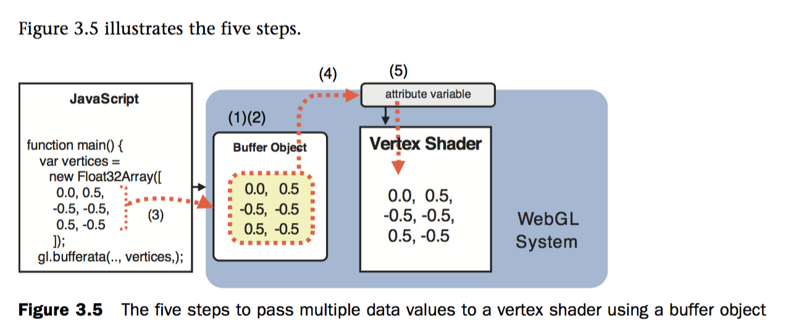

为了优化webgl同时处理大量同类型数据（如顶点和颜色数据）的性能，则引入了一种特殊数组`类型化数组（Typed Array）`, 因为这种数组的类型是预先已知的，因此可以进行高效处理。与普通js数组不同，不支持push和pop方法，并不能使用`[]`, 创建新的N个元素的空数组`new Float32Array(N)`,使用前请参考下图。
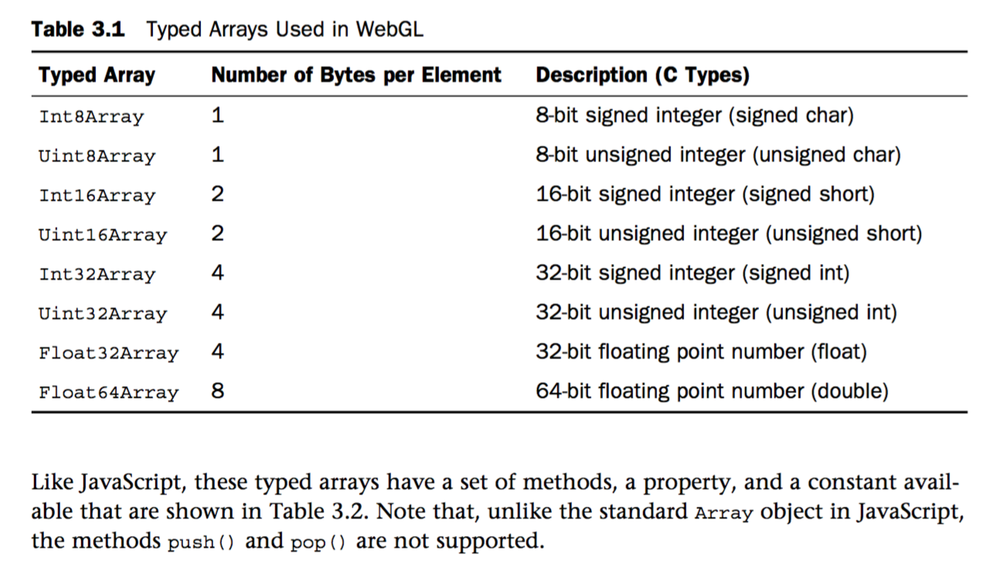
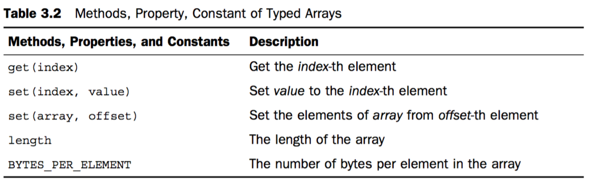

上面步骤中的每个方法的细则这里就不一一叙述，具体请参考原书。
这里直接放一张顶点着色器执行过程中的缓冲区数据是如何传输的
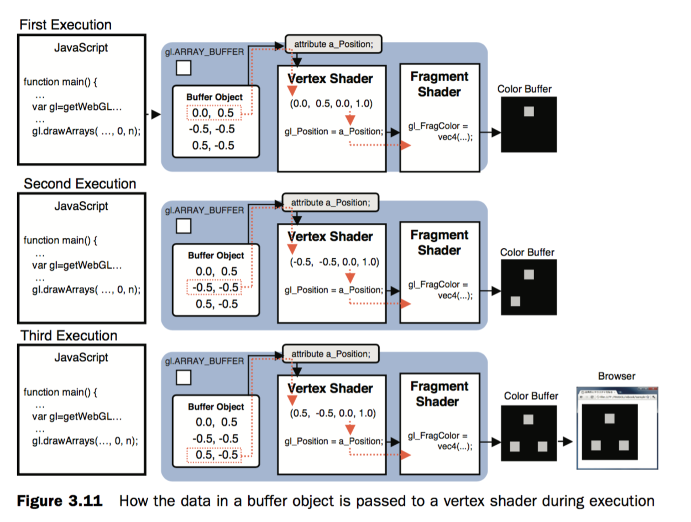

完整的参考Demo: [example](https://zdawning.github.io/MyLearnWebGL/WebGLDemo/chapter03/quad.html)

当存在多种种类的顶点数据时，可以采取为每种数据都建立一个缓冲区，因此则是多个缓冲区对象向着色器传递多种数据，这样从代码上来看比较易于理解，但是这种只能适合数据量不大的情况。当程序中需要载入上万个甚至更多个顶点时，这种做法就会导致顶点数据维护困难，则更加消耗CPU向显卡传递数据的性能和时间。因此与OpenGL一样，WebGL同样允许将多种数据打包在同一个对象中，使用`交错组织(interleaving)`数据来存储，然后步进和偏移参数来调整获取不同种类的数据。

> 这里的步进和偏移都要注意数组元素中每个元素的字节数问题，因为参数都是以字节为单位的。获取数据元素的字节数:`var FSIZE = verticesSize.BYTES_PER_ELEMENT`

#### 使用顶点索引绘制

当我们在绘制存在多个顶点叠加的图形时(非常常见)，很容易对相同的顶点重复绘制，在大量的顶点数据面前这种做法无疑是浪费。更好的解决方案是只储存不同的顶点，并设定绘制这些顶点的顺序就可以大大减轻开销。因此我们使用webgl提供的`gl.drawElements(mode, count, type, offset)` 绘制方法。

使用上面的方法之前，需要将索引数据绑定至索引缓冲区(indexBuffer), 然后通过该方法获取缓冲区中的索引值，从顶点缓冲区(vertexBuffer)中获取顶点坐标、颜色，法向量等信息，最后分配给attribute变量并执行顶点着色器。如下图：
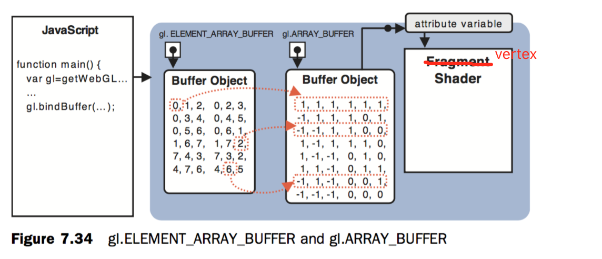

> 这种方式可以循环利用顶点信息，控制内存开销，对于一般的3d模型来说，这个方法算是性价比挺高的，但是代价是需要通过索引来访问顶点数据，某种程度上使程序复杂化了，所以要根据系统需求来使用。

### 几何形状的装配和光栅化

在顶点着色器和片元着色器之间，有两个进程：

1. 图形装配；将顶点坐标装配成几何图形，又称图元(primitives)，图形类别由绘制方法的参数mode决定
2. 光栅化；将装配好的几何图形转换成片元块

大概流程是：当顶点着色器获取到缓冲区中的坐标时，坐标数据经过处理后赋值给gl_Position, 此时已放入图形装配区；接下来继续执行顶点着色器，直至将所有的顶点数据传完，则开始根据mode参数类型来装配图形，然后通过光栅化把图形转变成图元，即可得到想要的像素块。

> 这个过程中如果有多余的顶点出现，则会在装配过程中舍弃

光栅化结束后，程序则开始逐片元调用片元着色器，每调用一次则处理一个片元，直至最后一个片元被处理。

> 片元着色其中有一个坐标变量：gl_FragCoord, 这个变量的1、2分量表示片元在窗口坐标系统中的坐标值，在编写shader的时候可以适当应用。

在顶点着色器和片元着色器之间，还有特别注意一种变量：varying
虽然说是varying变量是用于将顶点着色器的数据传递给片元着色器的，但这并不是简单的传递，而是经过内插过程(interpolation process), 一般采用的都是线性插值，其基本问题是内插值不可能大于较大的顶点值，编写复杂shader的时候这里要注意。

### 纹理映射

将图片贴到几何体表面的图片则称之为纹理图像或纹理(texture)，根据纹理图像，为之前光栅化好的每个片元添加上对应的图像颜色则称为纹素(texel)

使用纹理映射的主要步骤有：
* 准备好图像以映射至几何图形
* 为几何图形指定映射方式
* 加载纹理图像，加以配置方便在webgl中使用
* 在片元着色器中提取纹理中的纹素，对应设置给片元

> 上面所说的映射方式则是使用纹理坐标，在webgl系统中纹理坐标是二维的，为了区分x,y坐标，webgl使用s,t坐标(st坐标系统),如下图; 另外这个坐标系统还有另外一个名称：uv坐标。针对GLSL中的语法，st分量可以访问纹理，这里使用st更加合适。
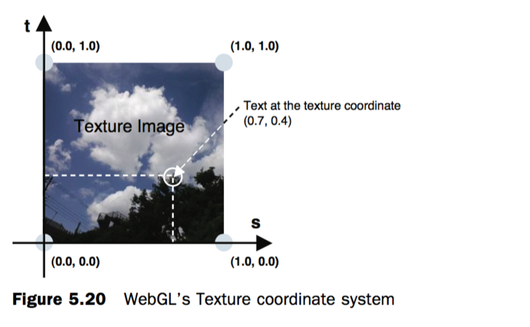

给几何体添加纹理的流程如下：
* 缓冲区数据上设置好纹理坐标
* 创建纹理对象 - gl.createTexture()
* 获取片元着色器中的取样器插槽
* 纹理图片加载完成后，开始配置纹理，一般的将纹理图像进行y轴反转
* 激活纹理单元(先从0号开始，webgl至少支持8个纹理单元)
* 绑定纹理对象
* 配置纹理参数
* 配置纹理图像
* 将纹理单元传递给片元着色器


> 取样器的作用实质是输入纹理坐标，返回纹理颜色。但是由于纹理像素是有大小的，取样器的纹理坐标很可能并不落在某个像素中心，则取样通常不是直接取纹理图像中的某个像素颜色，而是通过附近的若干个像素计算而得。

> 需要对纹理图像进行反转，原因是webgl中的纹理坐标的t轴方向与png,bmp,jpg等格式的图片坐标系统y轴方向是相反的，另外一种方法也可以在着色器中手动反转t轴坐标，但这样维护性较差，有时出错时很难判别是手误或是其他原因。

> 系统支持的纹理单元个数取决于硬件和浏览器的webgl内部实现，默认情况下，至少支持8个纹理单元，表示形态：`gl.TEXTURE0~7`

> webgl支付的纹理类型有两种：1.`二维纹理(gl.TEXTURE_2D)`, 2.`立方体纹理(gl.TEXTURE_CUBE_MAP)`

> 配置纹理对象参数和填充模式的方案：
如下图：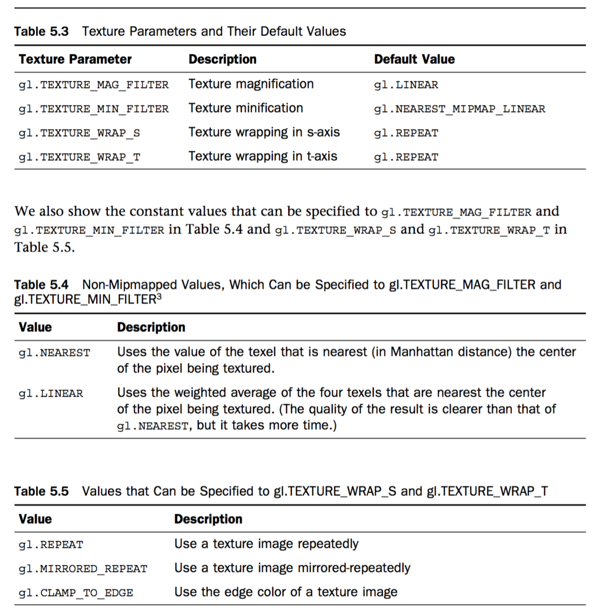
另外还有`mipmap`的纹理配置, 书中说可以直接查阅opengl的programming guide, 据我所知mipmap可是个好东西，它不仅仅是为了提高性能，而且能提高纹理质量减少失真情况。具体请查阅相关资料。

> 设置纹理图像参数时，需要指定纹素的格式，这个跟图片的格式有关：如jpg、bmp则指定为gl.RGB,PNG则是gl.RGBA,而类似灰度图等则用gl.LUMINANCE(L,L,L,1L:luminamce)或者gl.LUMINANCE_ALPHA(L,L,L,a).(luminance被称为发光率，指一个表面的光亮程度，通常使用物体表面r,g,b颜色分量值的加权平均来计算)

> 另外还要纹理数据类型，这里涉及很多图像数据压缩相关的，暂时未研究过，后面有需要再找资料，读懂后再提供参考资料地址。

> 传递纹理坐标的时候，一定注意从顶点着色器的varying变量再传递给片元着色器，如上文所说，其间需要有内插值。

示例代码：
```javascript
// 创建纹理对象
var texture = gl.createTexture();
//...
// 获取片元着色器中的取样器插槽
var u_Sampler = gl.getUniformLocation(gl.program, 'u_Sampler');
//...
var image = new Image();
image.onload = function(){
    loadTexture(gl, n, texture, u_Sampler, image);
}
image.src = "xxx.jpg";

function loadTexture(gl, n, texture, u_Sampler, image){
    // y轴翻转图片
    gl.pixelStorei(gl.UNPACK_FLIP_Y_WEBGL, 1);
    // 激活0号纹理
    gl.activeTexture(gl.TEXTURE0);
    // 绑定成2D纹理
    gl.bindTexture(gl.TEXTURE_2D, texture);

    // 设置纹理参数
    gl.texParameterf(gl.TEXTURE_2D, gl.TEXTURE_MIN_FILTER, gl.LINEAR);

    // 测试其他的纹理填充模式
    // 垂直方向镜像重复填充
    // gl.texParameteri(gl.TEXTURE_2D, gl.TEXTURE_WRAP_T, gl.MIRRORED_REPEAT);
    // 水平方向去取边缘值作为填充值
    // gl.texParameteri(gl.TEXTURE_2D, gl.TEXTURE_WRAP_S, gl.CLAMP_TO_EDGE);

    // 设置纹理图像参数
    gl.texImage2D(gl.TEXTURE_2D, 0, gl.RGB, gl.RGB, gl.UNSIGNED_BYTE, image);

    // 将纹理单元设置到采样器对象，纹理单元编号为0
    gl.uniform1i(u_Sampler, 0);

    gl.clear(gl.COLOR_BUFFER_BIT);
    gl.drawArrays(gl.TRIANGLE_STRIP, 0, n);
}

```

完整的参考Demo: [example](https://zdawning.github.io/MyLearnWebGL/WebGLDemo/chapter05/texture_quad.html)

<b>多重纹理的使用：</b>
* 激活多个纹理单元
* 片元着色器中创建多个采用器，传递给采用器时要使用对应的纹理编号
* 确保多个纹理单元已经准备完成后，在片元着色器中提取各个纹素的颜色将它们相乘即可


### GLSL ES的一些常见运用

GLSL ES是GLSL的简化版，因此很多地方几乎没有太大的变化，由于GLSL ES的语法在使用上非常灵活，特别是不同类型的相互运算，另外其内置函数也不少，因此这里罗列一些容易混淆或者遗忘的知识点，用于查阅和反复复习。

<b>矢量和矩阵类型</b>
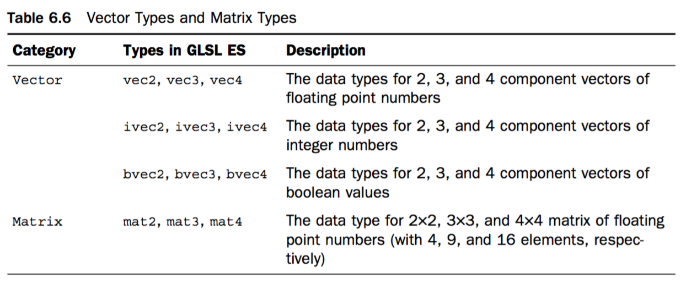

<b>矢量构造函数的应用</b>
```c
vec3 v3 = vec3(1.0, 2.0, 3.0);
vec2 v2 = vec2(v3); // (1.0, 2.0),将vec3变量放置与vec2,多出的分量会被丢弃
vec4 v4 = vec4(1.0); // (1.0, 1.0, 1.0, 1.0), 构造函数会自动将这个参数值赋给新建矢量的所有元素
// 这里的重要注意点是: 当构造函数接收超出1个参数的时候，如果参数个数少于新建矢量需要的元素个数时，则会报错;这对于矩阵来说也是一样
// 多个矢量组合（多则会丢弃，少则会报错）
vec4 v4New = vec4(v2, v4); // (1.0, 2.0, 1.0, 1.0)
```
<b>矩阵构造函数的应用</b>
```c
vec2 v2a = vec2(1.0, 2.0);
vec2 v2b = vec2(3.0, 4.0);
mat2 m2a = mat2(v2a, v2b); // 1.0 3.0
                           // 2.0 4.0
// 与上面等价
vec4 v4a = (1.0, 2.0, 3.0, 4.0);
mat2 m2a = mat2(v4a);
// 与上面等价
mat2 m2a = mat2(1.0, 2.0, v2b);

// 单位矩阵
mat4 m4 = mat4(1.0)
```

> 这里要说明一点，向矩阵构造函数中传入矩阵的每一个元素的顺序是列主序的，与上文中所使用的类型化数组一样，都是按列主序存储在数组中的（对OpenGL同样），可参考下图：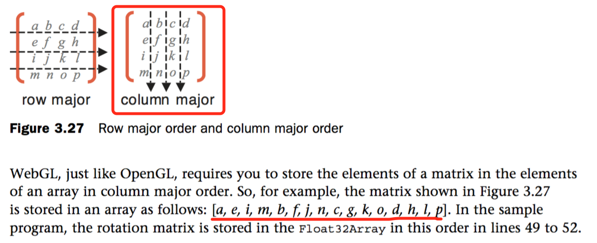

<b>访问元素</b>
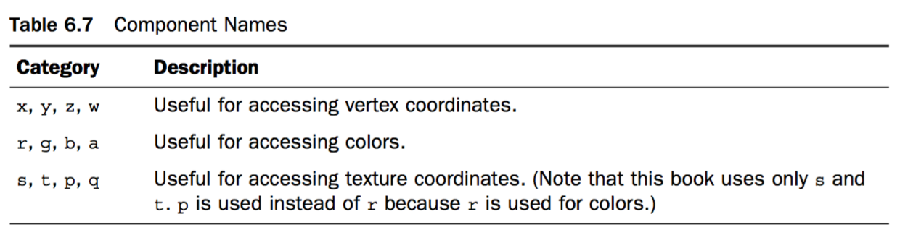

<b>分量名的应用</b>
```c
vec3 v3 = vec3(1.0, 2.0, 3.0); 
vec2 v2a = v3.xy; //(1.0, 2.0); 
vec2 v2b = v3.zy; //(3.0, 2.0);
vec2 v2c = v3.st; //(1.0, 2.0);
// 以上可省略、跳过、逆序来读取分量
// 注意：不同的类别的分量不能混在一起读取
```
`[]`<b>运算符</b>
```c
// 使用[]运算符对矩阵的读取也是列主序的
mat2 m2 = mat2(1.0, 2.0, 3.0, 4.0);// 1.0 3.0
                                   // 2.0 4.0
vec2 v2 = m2[0]; // (1.0, 2.0)，取出第一列的数据
// 连续两个[]运算符则可以访问某列的某个元素
float a = m2[0][1]; // 2.0
// 与上面等价
float a = m2[0].y;
// 另外一点是，如果要使用变量来代替索引值，则这个变量必须是常量索引值
const int index = 1;
vec2 v2 = m2[1]; // (3.0, 4.0)
```
> 注释中提到的常量索引值的定义是：1.整型;2.const修饰的全局或局部变量(不包括函数参数);3.循环索引

<b>矢量运算</b>
```c
vec3 v3 = (1.0, 2.0, 3.0);
float f = 5.0;
vec3 v3a = v3 + f = (6.0, 7.0, 8.0); // 矢量的分量与浮点数运算
// 矢量与矢量的运算
```
<b>矩阵运算</b>
```c
// 矩阵与浮点数的运算，亦是分量间运算
// 矩阵右乘矢量
vec3 v3 = (1.0, 2.0, 3.0);
mat3 m3 = (1.0, 2.0, 3.0, 4.0, 5.0, 6.0, 7.0, 8.0, 9.0);
vec3 v3New = m3 * v3; // 矩阵右乘矢量（列向量）的结果依然是矢量，下面展示过程：
// v3New.x = m3[0].x * v3.x + m3[1].x * v3.y + m3[2].x * v3.z;  1.0*1.0+4.0*2.0+7.0*3.0=29
// v3New.y = m3[0].y * v3.x + m3[1].y * v3.y + m3[2].y * v3.z;  2.0*1.0+5.0*2.0+8.0*3.0=36
// v3New.z = m3[0].z * v3.x + m3[1].z * v3.y + m3[2].z * v3.z;  3.0*1.0+6.0*2.0+9.0*3.0=42
// 矩阵左乘矢量（这里并非是数学上的那个无定义的计算，实质是此时的矢量已经转变成了行向量, 行向量左乘矩阵结果依然是行向量）
vec3 v3New = v3 * m3; // 下面展示过程：
// v3New.x = m3[0].x * v3.x + m3[0].y * v3.y + m3[0].z * v3.z;  1.0*1.0+2.0*2.0+3.0*3.0=13
// v3New.y = m3[1].x * v3.x + m3[1].y * v3.y + m3[1].z * v3.z;  4.0*1.0+5.0*2.0+6.0*3.0=32
// v3New.z = m3[2].x * v3.x + m3[2].y * v3.y + m3[2].z * v3.z;  7.0*1.0+8.0*2.0+9.0*3.0=50
// 由上可以得出矩阵右乘矩阵和左乘矩阵的结果是不相等的
// 矩阵与矩阵相乘（一般来说都是方阵与方阵相乘，另外在乘法有意义的情况下，任意矩阵与方阵相乘的结果，不然哪边乘，都得到原矩阵大小的矩阵）
// 为了简便展示过程，假设存在m3a,m3b两个方阵
mat3 m3 = m3a * m3b; // 下面展示过程：
// m3[0].x = m3a[0].x * m3b[0].x + m3a[1].x * m3b[0].y + m3a[2].x + m3b[0].z;
// .... 如此类推
```
<b>结构体</b>
```c
// 定义结构体类型light
struct light {
    vec4 color;
    vec3 position;
} 
// 直接声明light类型变量
light spotLight, pointLight;
// 可使用结构体的构造函数赋值
spotLight = light(vec4(1.0), vec3(1.0));
// 可使用比较运算符==和赋值运算符=
if(spotLight == pointLight) // 当且仅当对应的所有的成员都相等才是true
// 这里要注意：赋值和比较运算符不使用与含有数组与纹理成员的结构体
```
<b>数组</b>
```c
// 声明数组直接在类型变量后加[]和个数即可, 数目需要变量控制需要const来声明, 另外GLSL ES仅支持一维数组
float fArr[3];
vec3 v3Arr[3];
// 初始化数组不能一次性初始化，仅能显式地对每一个元素处理
```
<b>取样器</b>
取样器有两种：`sampler2D`和`samplerCube`

<b>条件语句</b>

这里特别指出：discard. 它只能使用片元着色器中，表示放弃当前片元直接处理下一个片元。

这里有个示例可以了解它的使用

完整的参考Demo: [example](https://zdawning.github.io/MyLearnWebGL/WebGLDemo/chapter10/rounded_point.html)

<b>函数</b>

函数的用法类似于c语言，一个重要的不同点是：不能再函数内部调用它本身，即递归调用是不允许的，这个限制是方便编译器对函数内联展开。

另外一点是关于函数的`规范声明`,如果函数定义在其调用之后，则必须在调用前先声明该函数的规范，即预先告诉函数的参数，参数类型，返回值等。

GLSL中可以为函数指定`参数限定字`,以控制参数行为。可分为3种：
1. 传递给函数
2. 将从函数中回传，即在函数中被处理后并传出的
3. 上面两者都有

下图为参数限定词的说明和举例
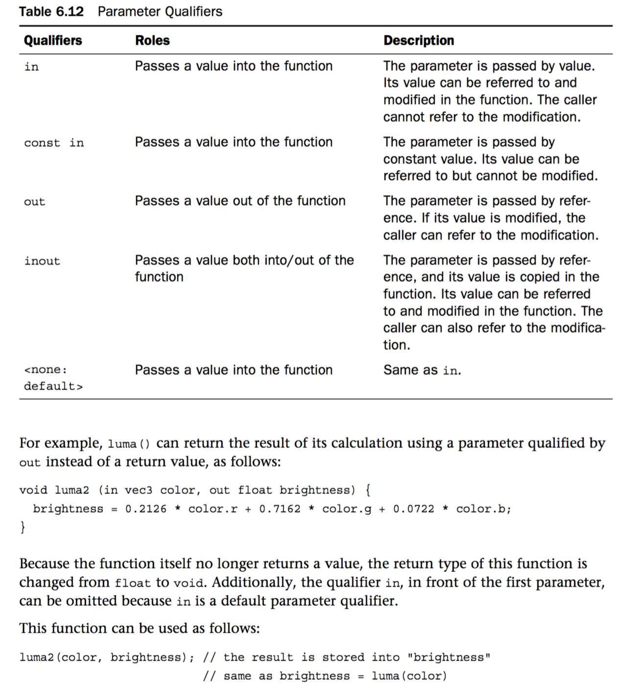

另附 内置函数表：(个人觉得这里中文版比较合适)
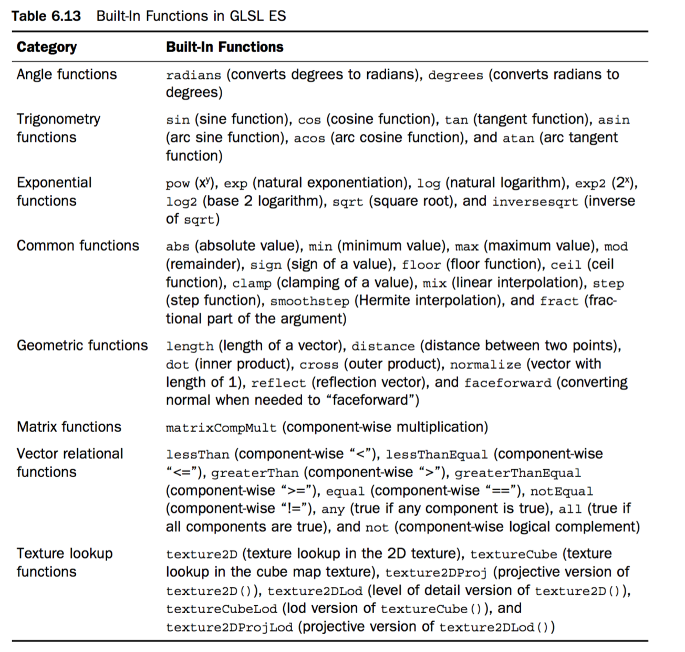

<b>存储限定字</b>

`const`常量是不能重新赋值的

`attribute`变量仅存在顶点着色器中，在该着色器中是全局变量，表示`逐顶点`数据。类型只能是float,vec2-4,mat2-4

`uniform`变量可以用于顶点着色器和片元着色器，并且是两个着色器共享的只读全局变量，可以是除了数组或结构体之外的的任意类型

`varying`变量可以用于顶点着色器和片元着色器, 用于两个着色器传递数据，类型只能是float,vec2-4,mat2-4, 数值在内部会被内插，故数据类型需要限制

> attribute，uniform和varying的最大数目与设备有关，参照下图：
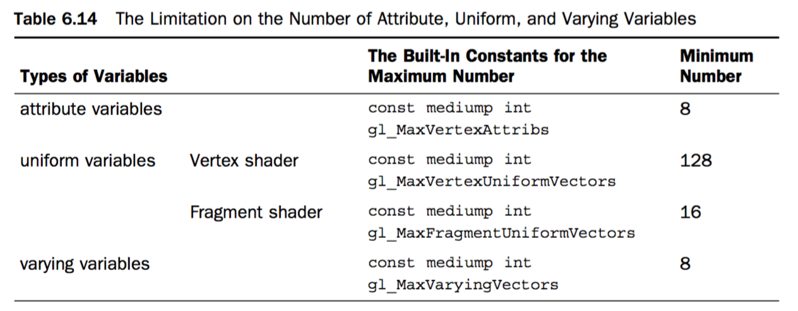

<b>精度限定字</b>

可以指定每种数据拥有的精度(the number of bits),设置高精度则需要更大的性能开销（更大的内存和更多的计算时间），因此可以对性能和大小方面进行细化控制。

一般情况下设置适中即可：
```c
#ifdef GL_ES
precision mediump float;
#endif
```
两种着色器中大多的数据类型都配置了默认精度，只有片元着色器的float类型没有配置，因此要向上面的示例一样配置

数据类型中共有三种精度（highp, mediump, lowp）,参考下图
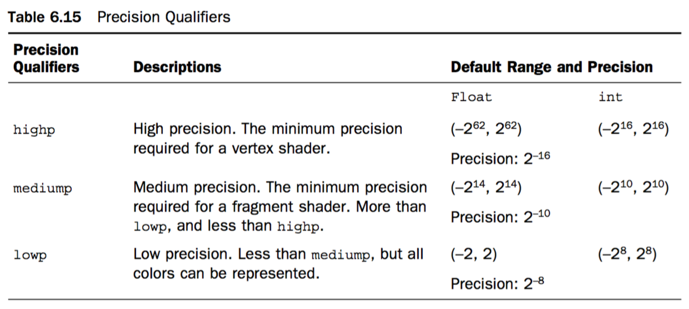

<b>预处理指令</b>

在编译前对代码进行预处理，以#开始
```c
// 第一种
#if 条件表达式
// 表达式为true
#endif
// 第二种
#ifdef 某宏
// 定义了宏
#endif
// 第三种
#ifndef 某宏
// 没有定义宏
#endif

// define指令进行宏定义
#define 宏名 宏内容
// 解除宏定义
#undef 宏名

#version int (可以指定着色器的GLSL ES使用的版本，必须在最顶部)

// 示例1：
#define version 1.0
#if version == 1.0
// true
#else
// false
#endif

// 示例2：(使用宏来规定精度使用)
#ifdef GL_ES
#ifdef GL_FRAGMENT_PRECISION_HIGH
precision highp float;
#else
precision mediump float;
#endif
#endif
```

### 视点与视线

这里理清两个概念：1.相机所处的位置则为`视点`；2.从相机出发指向某个方向的射线则为`视线`

为准确定义相机的所处的状态，需要三个重要的基础信息：

1. 相机的`上方向(up direction)`
2. `视点`
3. `观察目标点`，只有知道视点和观察目标点后，才能求出视线向量

因此可以利用上面三个矢量创建一个视图矩阵(viewMatrix) 
```javascript
// 每三个参数分别是视点，观察目标点，上方向
viewMatrix.setLookAt(eyeX, eyeY, eyeZ, atX, atY, atZ, upX, upY, upZ)
```
> 这里还有一个很重要的知识点（认知）：因为移动视点与移动被观察的对象时等效的，因此改变观察者状态与对整个场景进行变换，本质是一样的。为了更好地解释这个知识点，下面罗列几个公式推论：
1. 如果想变换物体，则需要将变换矩阵与物体的原始顶点相乘：`变换后的顶点坐标 = 变换矩阵 * 原始坐标`，物体多个组合变换而成的矩阵又称`模型矩阵`
2. 从变换的角度上看，视图矩阵乘以顶点坐标把顶点变换至合适的位置，使相机在不移动的情况下观察新位置的顶点，与从视觉的角度上来看，相机移动至视图矩阵所描述的视点上观察原始顶点的效果是一样的。因此可得：`视点上看过去的新坐标 = 视图矩阵 * 变换后的顶点坐标`
3. 由上可得：`视点上看过去的新坐标 = 视图矩阵 * 模型矩阵 * 原始坐标`, 则MV矩阵（又称模型视图矩阵）由此而来

### 可视空间

有两类常用可视空间：1.`正投影(Orthographic Projection)`, 2.`透视投影(Perspective Projection)`

两种空间由前后两个矩形面决定：1.`近裁剪面(near clipping plane)`, 2.`远裁剪面(far clipping plane)`

```javascript
// 创建正投影矩阵，两两参数都不要求相等
viewMatrix.setOrtho(left, right, bottom, top, near, far);
// 创建透视投影矩阵，fov为垂直视角即可视空间顶面与底面间的夹角, aspect为近裁剪面的宽高比, near必须小于far
viewMatrix.setPerspective(fov, aspect, near, far)
```

### 隐藏面消除（开启深度测试）

如果不开启深度测试进行隐藏面消除，则需要每次都要给场景中的对象进行排序，并且在移动视角的时候也要决定他们的前后顺序，这种做法明显是不可取的。

因此WebGL(与OpenGL一样)给我们提供了这个功能。步骤如下：

1. 开启深度测试 - gl.enable(gl.DEPTH_TEST);
2. 绘制前清除深度缓冲区 - gl.clear(gl.DEPTH_BUFFER_BIT);

> 深度测试其原理就是检测物体每个像素的深度来是否决定将其绘制出来。而深度缓冲则是由浏览器经过窗口系统自动创建，以16,24或32位浮点数的形式存储深度值，大部分系统中都是24位的。

> 开启深度测试后，webgl会将每一个片元的深度与深度缓冲区中的内容做对比，如果测试通过，则会在深度缓冲中存储该片元的z值(经过归一化至0.0-1.0)，若没有通过，则会被丢弃该片段。另外在渲染的每次更新的时候都要重新清除深度缓冲区，否则缓冲区中会保留上一次存储下来的深度内容。

> 在某种情况下，例如透明的物体与不透明的物体在场景中友好共存，此时的深度测试就会显得非常鸡肋了（因为比较的是深度而无关透明度，从透明的物体前面一样可以看到后面的物体），因此我们可以建立以下策略来应对：

1. 开启深度测试
2. 绘制所有不透明的物体（a = 1.0）
3. 同样开启深度测试，但是设定深度缓冲区的权限为只读(read-only), 则无法写入深度值。因此直接设置`gl.depthMask(false)`即可
4. 绘制所有半透明的物体（a < 1.0）,另外也应该手动根据深度排序,从后向前绘制
5. 释放深度缓冲区的权限限制`gl.depthMask(true)`

补充理解：1,2步之后，深度缓冲中存储的是最前面的深度值，3，4步后，凡是大于最前面的深度值的片元都被丢弃，同时小于却也无法更新深度缓冲区，自然保留了片元。

一般情况下，开启隐藏面消除后都能正常工作，但是也会遇到奇怪的现象（面与面非常接近时，会出现相互交叉的闪动），这种现象称为`深度冲突（z-fighting）`

> 深度冲突的原因是面与面之间有大面积的过于接近，深度缓冲区中的有限精度已经无法区分谁前谁后了，这种状况如果在运动的物体当中很可能会发现，因此welgl提供了一种叫`多边形偏移(polygon offset)`的机制来解决这个问题。该机制自动在z值上添加上一个偏移量，且偏移量的值由物体表面与视线的角度来确定。使用时直接开启：

```javascript
// 启用多边形偏移
gl.enable(gl.POLYGON_OFFSET_FILL);
// 绘制前指定偏移量参数, 偏移量会加到每个被绘制的顶点的z值上。偏移量按照公式：m * factor + r * units, m为上面提到的角度, r为硬件可区分值差的最小值
gl.polygonOffset(1.0, 1.0); // factor, units
```

### 光照

基础光照的类型有：

1. `环境光(ambient light)`, 没有光源，但是由其他光源经过场景中的其他介质反射过来的光
2. `平行光(direction light)`, 类似太阳光, 从无穷远处发射过来的光
3. `点光源(point light)`, 类似灯泡一样的光，从光源处向四周发射出去光
4. `聚灯光(spot light)`, 类似手电筒一样的光，从光源处呈圆锥状发射出去的光

> 由于做的并非是光线追踪，这里仅以一些简单算法来求取各种光效。

环境光：`环境光颜色 = 入射光颜色 * 表明基底色`

漫反射光: `漫反射光颜色 = 入射光颜色 * 表面基底色 * cosθ`，θ为入射角，是光线向量L与表面法向量的夹角N，当把这两个向量进行归一化后, 
L·N(点乘) = |L| * |N| * cosθ = cosθ. 另外入射角>=90°的反射光都为0 ，最后可得公式：

`漫反射光颜色 = 入射光颜色 * 表面基底色 * (光线向量(归一化) · 法线向量(归一化))`

> 归一化的内部计算是：矢量的各个分量除以矢量的长度。长度的算法是矢量各个分量的平方根之和的开平方

> 每个平面都要两个法向量（除了开启背面消除），判断平面的正反面的法向量，可用通过绘制这个面的点的顺序方向（采用右手法则）来识别。一个平面只有一个法向量，表明方向，其法向量与位置无关

<b>经过变换后的物体的光照</b>

当物体发生平移(仿射变换）、旋转、缩放的组合变换后，物体的每个表面的法向量可能会发生变化，因此需要`模型矩阵的逆转置矩阵(inverse transpose matrix)`来重新修正法向量（关于原理的话请看原书或者查阅相关资料）。如果变换没有发生形变（各轴缩放因子相同），并且觉得每次都进行逆转置转换太消耗性能，可以直接用模型矩阵修正即可。
```javascript
Matrix4 normalMatrix = new Matrix4(); // 单位矩阵
normalMatrix.setInverseOf(modelMatrix); // 求逆
normalMatrix.transpose();
```

<b>光线的衰减(attenuation)</b>

光线的强度随着传播的距离的变远而逐渐消减，而这种衰减如果只用一种线性方程来处理的话，那么效果非常差。为了更加逼真，已有一道光线的衰减公式可用：

```
c:常数衰减因子 (缺省值：1.0)
l:线性衰减因子 （0.0）
q:平方衰减因子 （0.0）
d:受光点与光源的距离 

f = 1 / ( c + l * d + q * d * d )

光的亮度 = 初始亮度 * f
```
这种衰减一般用于点光源和聚光灯中

<b>聚光灯</b>

聚光灯可用说是继承自点光源，而不同点是加了特定方向的约束。下图是聚光灯的特性：


`LightDir`：由片元指向光源的向量

`SpotDir`：聚光灯所瞄准的方向的向量

`Phi(ϕ)`：聚光半径的截止角，在截角之外的地方都不会被聚光灯所照亮

`Theta(θ)`：LightDir和SpotDir向量之间的夹角，在聚光内部的θ值小于ϕ值。

关于如何使用制作一个效果不错的聚光灯，由于步骤较多这里就不一一赘述，可以直接参考[learnOpenGL](https://learnopengl.com/Lighting/Light-casters)

### 层次模型

对于层次模型，其实没有新的知识点要了解，主要是在绘制方法上控制好层级的绘制顺序即可，另外一点是最好是使用一个存储矩阵的数组控制矩阵的出栈和入栈的使用。
具体的流程和注释已经完整写在demo当中，直接参考代码比较容易理解

完整的参考Demo: [example](https://zdawning.github.io/MyLearnWebGL/WebGLDemo/chapter09/multi_join_model.html)

### 雾化

这个原理与OpenGL那边的实现基本相同，这里直接指引至我的[OpenGL进阶指引-雾化](https://github.com/zDawnING/MyLearnOpenGL/blob/master/docs/improve_note.md#%E9%9B%BE%E5%8C%96)

完整的参考Demo: [example](https://zdawning.github.io/MyLearnWebGL/WebGLDemo/chapter10/control_fog.html)

### alpha混合

如果要给物体实现半透明，则需要开启alpha混合，步骤如下：
```javascript
// 开启混合
gl.enable(gl.BLEND);
// 指定混合函数
gl.blendFunc(gl.SRC_ALPHA, gl.ONE_MINUS_SRC_ALPHA);
// 这里的示例可以理解为：1:源alpha, 2: 1-源alpha（目标alpha），该方法的前者是混合的时候源采用什么样的alpha,后者是目标采用什么的alpha.
```
在使用混合时，需要用到两个颜色, 即`源颜色(source color)`和`目标颜色(destination color)`, 而混合即是目标颜色混进了源颜色当中，但参数的实质是指定源/目标颜色在混合后的颜色中所占的权重
```
gl.blendFunc(src_factor, dst_factor)
// 混合后的颜色的计算公式为：
color (RGB) = source color × src_factor + destination color × dst_factor
```
另外还要一种常用的混合：`加法混合(additive blending)`, 这种混合会使绘制区域格外明亮，一般用做爆炸效果或亮光提醒

下图为参数权重因子的系数表和颜色计算例子：
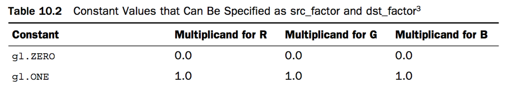
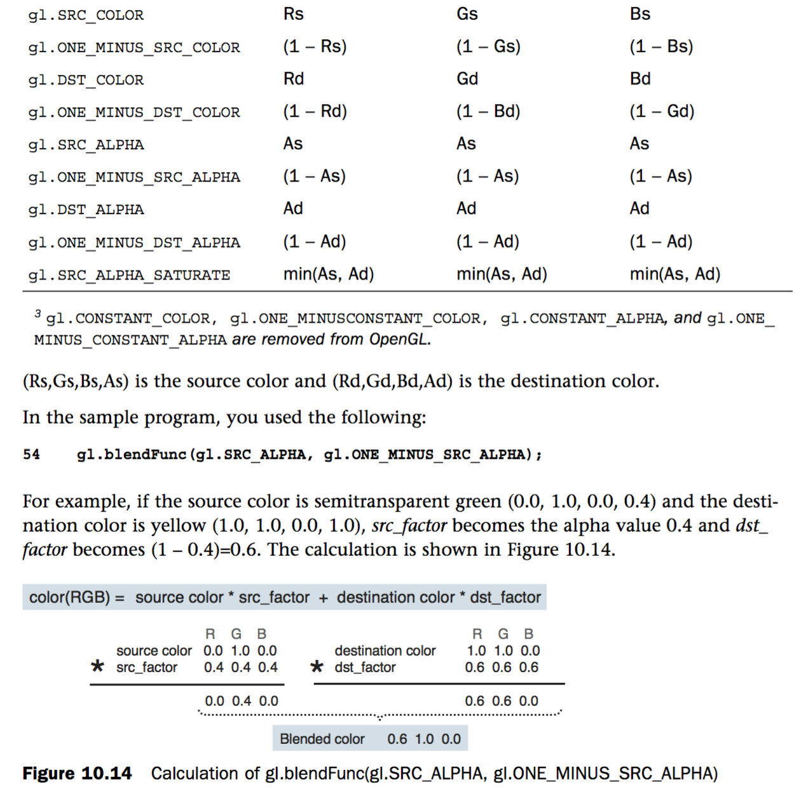

### 帧缓冲

默认情况下，webgl在颜色缓冲区中绘图，开启深度测试后，还会写入深度值至深度缓冲区，其绘制的图像依然保持在颜色缓冲区中。（这可能与OpenGL不同(有机会查证一下)，OpenGL是在一个默认帧缓冲中绘制的，而自定义的则为离屏渲染）

帧缓冲区对象(FBO)是存储在内存中用于代替颜色缓冲区或深度缓冲区的，与颜色缓冲区不同的是，它不会立即将绘制结果渲染至canvas上，因此可以先对缓冲区中的内容进行更改处理再显示或是作为纹理图像来处理。在帧缓冲区中绘制的过程称为离屏绘制(offscreen drawing)

首先绘制操作不是直接发生在帧缓冲区中，而是帧缓冲区中的附件对象所指向的绘图区域当中。帧缓冲区有3个附件对象：
1. 颜色附件对象(color attachment), 代替颜色缓冲区
2. 深度附件对象(depth attachment), 代替深度缓冲区
3. 模板附件对象(stencil attachment), 代替模板缓冲区


下图展示帧缓冲区对象结构：
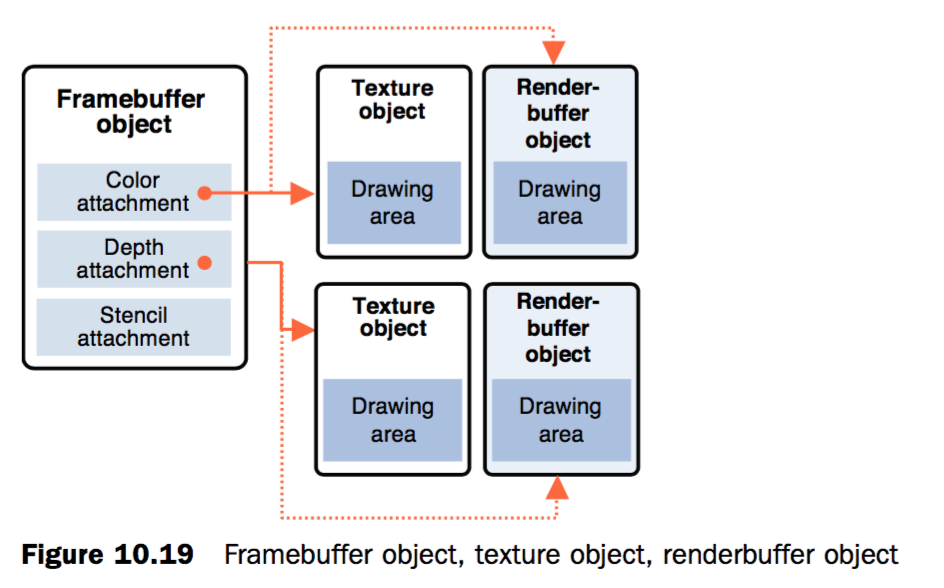

> webgl向帧缓冲区的附件对象写入数据，与在颜色缓冲区或深度缓冲区无异。另外每个附件对象可以有两种类型：`纹理对象`或`渲染缓冲区对象`（如上图）。

> 如果把纹理对象作为颜色附件对象附加到帧缓冲区中，就可以在纹理对象中绘图

> 渲染缓冲区对象则是一种更多用途的绘图区域，可以向里面写入各种类型的数据


这里描述下使用帧缓冲的流程：
1. 创建帧缓冲区对象 - gl.createFramebuffer()
2. 创建纹理对象并设置尺寸和参数 - gl.createTexture(), gl.bindTexture(), gl.texImage2D(), gl.Parameteri()
3. 创建渲染缓冲区对象 - gl.createRenderbuffer()
4. 绑定渲染缓冲区对象至target并设置尺寸 - gl.bindRenderbuffer(), gl.renderbufferStorage()
5. 把纹理对象添加至帧缓冲区的颜色附件对象上 -  gl.bindFramebuffer(), gl.framebufferTexture2D()
6. 把渲染缓冲区对象添加至帧缓冲区的深度附件对象上 - gl.framebufferRenderbuffer()
7. 检查帧缓冲区对象是否配置正确 - gl.checkFramebufferStatus()
8. 使用帧缓冲区对象绘制 - gl.bindFramebuffer()

> `gl.texImage2D`的最后一个参数是图像数据，在这里可以设置为null, 为纹理对象分配一块空白的存储纹理图像区域，并注入对象至帧缓冲对象中方便访问。

> 解除渲染缓冲区的绑定直接 `gl.bindRenderbuffer(gl.RENDERBUFFER, null)`，解除帧缓冲对象也类似

> 深度附件对象和渲染缓冲区的宽高必须与颜色附件对象的纹理缓冲区相同

> 与OpenGL不同的是，WebGL的颜色附件对象只能有一个

> 在使用帧缓冲实现渲染到纹理要注意性能和绘制速度的考虑, 如何可以的话可以开启背面消除功能，理想的情况下可以减半开销和加速。`gl.enable(gl.CULL_FACE)`

最好是看一下这里的完整示例，可以更清晰理解过程：

完整的参考Demo: [example](https://zdawning.github.io/MyLearnWebGL/WebGLDemo/chapter10/framebuffer_object.html)

### 阴影

这里的阴影实现原理是：将相机放置与光源位置相同的地方，视线与光源一致，比较物体在光源坐标系下的深度值，如果同一个射线下存在多个深度值，除了最小的深度之外其他深度值所对应的点都在阴影当中。如下图：
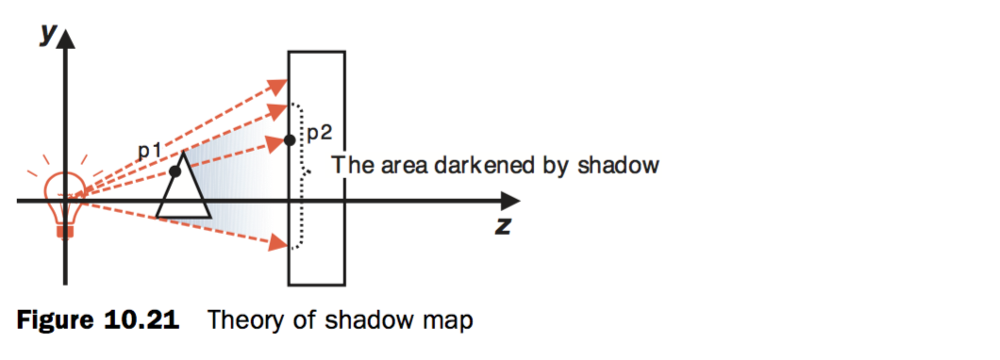

下面使用<b>两对</b>着色器来实现阴影：

1. 首先实现一张叫`阴影贴图(shadow map)`的纹理，利用帧缓冲区存储，计算光源与物体距离distance

> 直接理解这里比较莫名其妙，实际上是我们通过在纹理中将distance数据(实质是深度z值)存储在纹素当中，然后通过`阴影映射(shadow mapping)`来实现真正的阴影绘制。

> 生成阴影贴图的片元着色器所用的gl_FragCoord.xy是片元在屏幕的坐标，z值则是深度值，是通过下面公式求得：
> `(gl_Position.xyz / gl_Position.w)/2.0 + 0.5`, 公式中进行的归一化，即限制范围在(0, 1), 这个是纹理坐标和纹素的区间范围。

2. 阴影映射的过程是：
* 将视点放置于光源处，运行创建阴影贴图的着色器，将当前片元的z值写入阴影贴图中，写入方式是放在纹理贴图的颜色某个分量上
* 将视点移回正常位置，使用新的一对着色器绘制场景，在顶点着色器中求出每个顶点在光源坐标系下的坐标并（通过内插）传入片元着色器，此时得到片元在光源坐标系下的坐标。阴影映射坐标则可从这个坐标进行上面公式的投影处理和归一化(0,1)可得，又因为阴影映射坐标中的xy分量是当前片元在阴影贴图中对应纹素的纹理坐标，那么可以使用取样器将阴影贴图中的存储了深度值的某分量取出，将这个深度值与阴影映射坐标中的z值做比较，如果后者大于前者则当前片元在阴影当中。

> 在上面的比较过程中，往往要给深度值加上一个偏移量来做调整，如果没有这个偏移，阴影有可能会出现出现马赫带(mach band)现象(斑马纹), 出现马赫带的主要原因是阴影贴图存储的深度数据精度与实际深度缓冲区中的深度精度不匹配造成的。下图是书中解释偏移量的设置原因和计算方法：
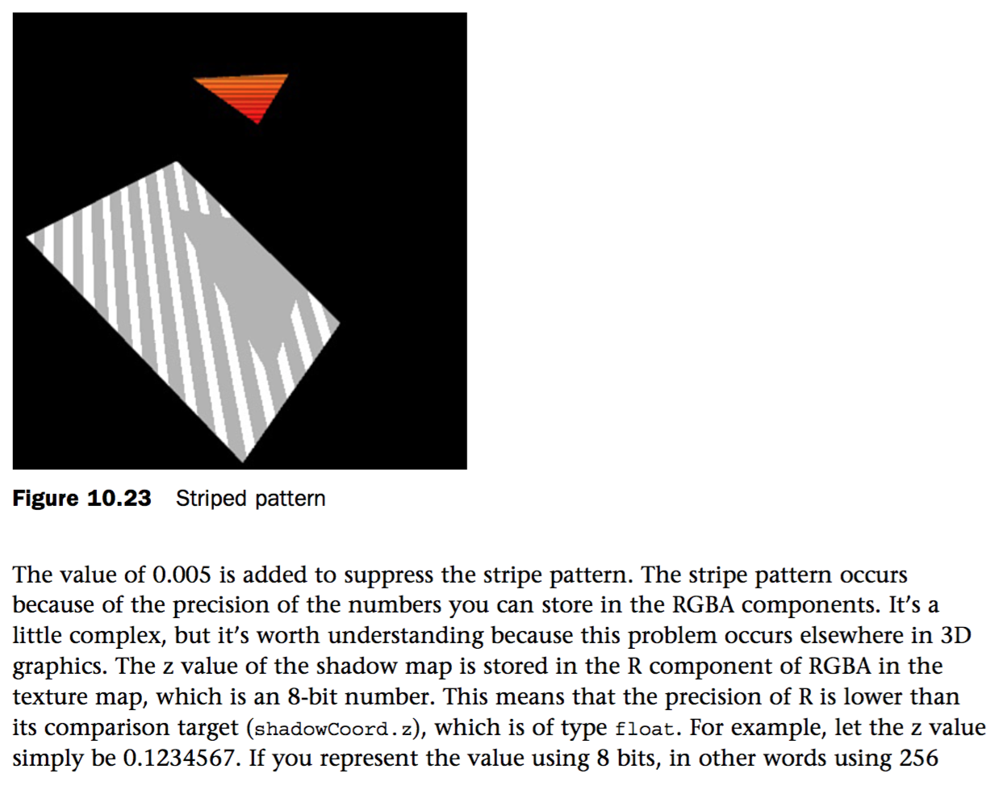
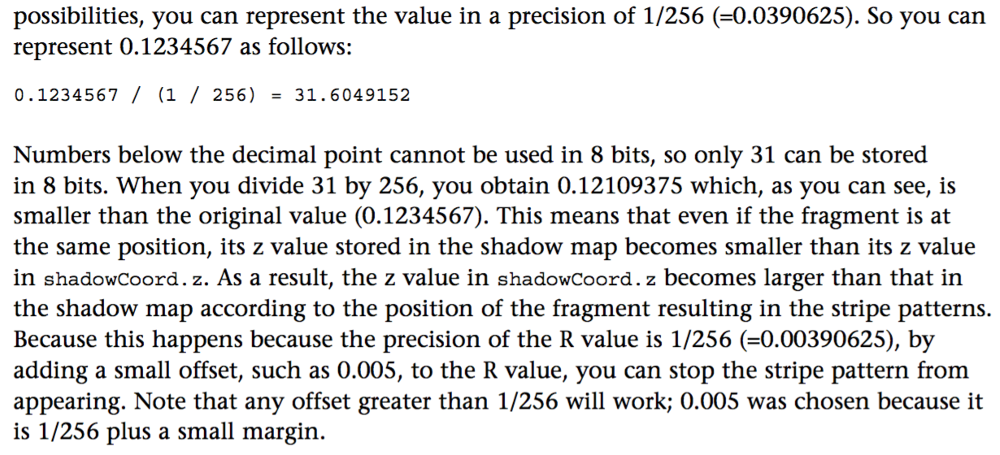

> 有个问题就是，一旦光源距离比较远就会导致阴影消失，因为gl.FragCoord.z在光源足够远的时候，距离的值太大而无法存储在8位的颜色分量中，解决方案是：使用阴影贴图中的r,g,b,a这四个分量，用4个字节共32(4x8)位来存储z值。解释说明如下图：
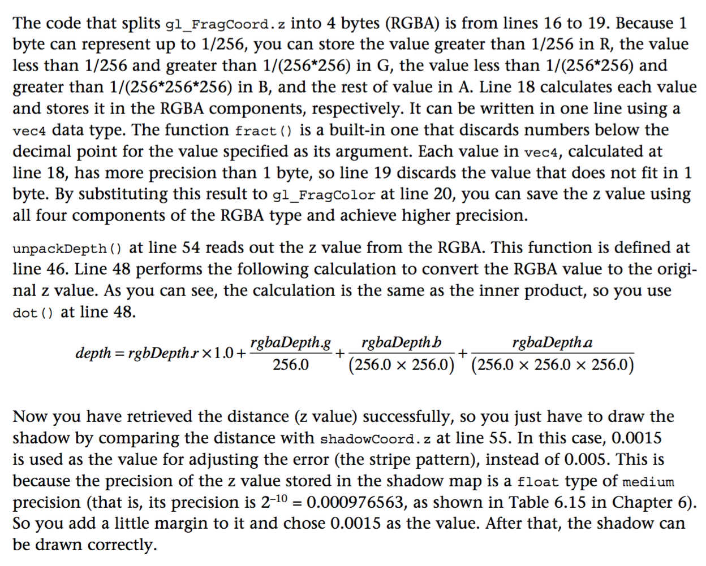

完整的参考Demo: [example](https://zdawning.github.io/MyLearnWebGL/WebGLDemo/chapter10/shadow.html)

### 3D模型解析

市面上的3D建模工具种类非常多，格式也千差万别，这里只讲述解析模型的基本步骤和一些解析方案，并举例obj这种非常常见的模型格式。

关于obj模型文件的介绍就不多说了，自行查阅资料。这里先描述它的基本特点：
1. `.obj`文件仅是一种3D模型文件，不包含动画、材质特性、贴图路径、物理特性、粒子等信息
2. `.obj`文件主要支持多边形模型，支持3个点以上的面(即非三角形网格)
3. `.obj`文件支持法线(normal)和纹理坐标(texCoord)

obj模型的基本组成包括`顶点坐标部分`，`表面定义部分`，`材质定义部分`等，其基本结构：
1. `#`开头的注释内容，一般是建模软件自动生成的或是人工添加(提供可读性)
2. `usemtl`开头则是材质引用，由于obj模型文件不存储材质信息，则材质信息由外部的MTL文件来存储，obj文件中只放置了引用
3. `v`开头的行定义了模型的顶点信息，其中w是可能不存在，没有则为1.0, 而`v`后面还有字母的，如`vt`,`vn`则分别是纹理坐标和法线
4. `f`开头的行定义了模型的面索引，其中一行的数据项(每项之间有空格隔开)有4个，每项可能有`/`进行分割其他数据类型项，格式：`f 顶点索引/uv点索引/法线索引`

> `f`行中的数据要注意绘制面索引的顺序，从第一个点开始至第四个点，连接点的顺时针和逆时针排列决定法线的方向(即面的正反)，面的连接点错误是导致出现模型碎面的一个重要原因。另外一个面不能出现相同的顶点索引，这个是检查obj文件出错的要点。

MTL材质文件的基本组成：
1. `#`开头的注释内容
2. `newmtl`开头则是定义新材质，后面则是材质名，该名会被obj文件所引用
3. `Ka`,`Kd`,`Ks`，顾名思义，分别是表面的环境色，漫射色，高光色，颜色格式可能是RGB(暂不知有没有A,待查证)，每个分量范围`[0.0, 1.0]`
4. `Ns`,`Ni`,`d`, `illum`,分别表示高光色的权重，表面光学密度，透明度，光照模型

> 这里提供一些obj文件中可能出现的顶点数据类型：(其实就是先混眼熟，后面不容易被某些陌生的数据干扰思考)

```javascript
  顶点数据(Vertex data)：
  v 几何体顶点 (Geometric vertices)
  vt 贴图坐标点 (Texture vertices)
  vn 顶点法线 (Vertex normals)
  vp 参数空格顶点 (Parameter space vertices)

  自由形态曲线(Free-form curve)/表面属性(surface attributes):
  deg 度 (Degree)
  bmat 基础矩阵 (Basis matrix)
  step 步尺寸 (Step size)
  cstype 曲线或表面类型 (Curve or surface type)

  元素(Elements):
  p 点 (Point)
  l 线 (Line)
  f 面 (Face)
  curv 曲线 (Curve)
  curv2 2D曲线 (2D curve)
  surf 表面 (Surface)

  自由形态曲线(Free-form curve)/表面主体陈述(surface body statements):
  parm 参数值 (Parameter values )
  trim 外部修剪循环 (Outer trimming loop)
  hole 内部整修循环 (Inner trimming loop)
  scrv 特殊曲线 (Special curve)
  sp 特殊的点 (Special point)
  end 结束陈述 (End statement)

  自由形态表面之间的连接(Connectivity between free-form surfaces):
  con 连接 (Connect)
  成组(Grouping):
  g 组名称 (Group name)
  s 光滑组 (Smoothing group)
  mg 合并组 (Merging group)
  o 对象名称 (Object name)

  显示(Display)/渲染属性(render attributes):
  bevel 导角插值 (Bevel interpolation) 
  c_interp 颜色插值 (Color interpolation) 
  d_interp 溶解插值 (Dissolve interpolation) 
  lod 细节层次 (Level of detail) 
  usemtl 材质名称 (Material name) 
  mtllib 材质库 (Material library) 
  shadow_obj 投射阴影 (Shadow casting) 
  trace_obj 光线跟踪 (Ray tracing) 
  ctech 曲线近似技术 (Curve approximation technique) 
  stech 表面近似技术 (Surface approximation technique)
```

<b>解析模型文件</b>

所谓解析模型文件就是将webgl不能直接读取成模型的模型文件通过手工拆解数据结构来转变成可用的模型数据，然后再绘制出来。

工欲善其事必先利其器，在解析文件内容之前，得准备好相应的工具：
1. 加载文件函数，用于加载本地文件，类似之前的例子中加载外部的shader文件一样
2. 字符串解析类，用于对读取到的模型文件内容字符串进行每一行的解析，并重新构造数据并存储成对应的模板对象放置与指定的数据载体中。
3. 模型文件的文档模板对象，包括材质模板对象，模拟C语言中的结构体，使解析出来的数据有一个合适的数据结构
4. 解析后的数据载体，负责存储解析后的全部类型数据，提供模型绘制时数据的读取

划分数据层级，根据层级从上往下解析，下图为obj文件中的数据结构, 理解该结构即可理清解析步骤。
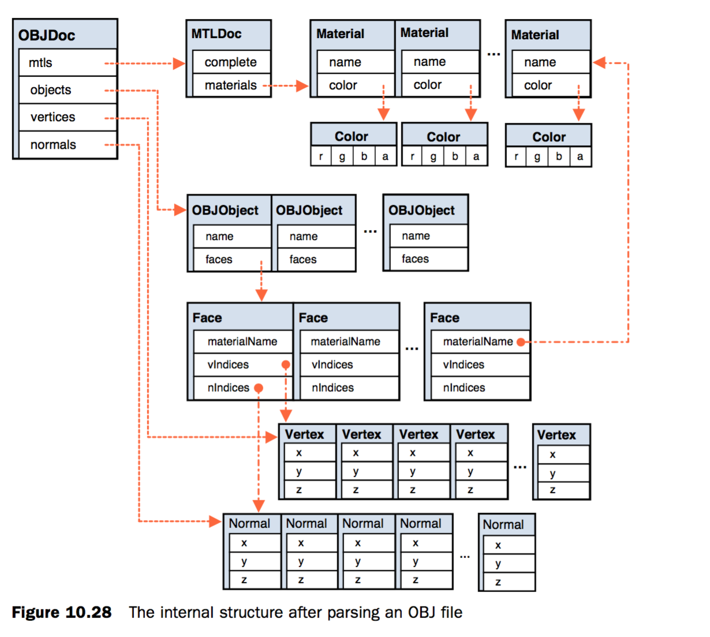

可以直接阅读demo中的解析模型代码来观察整个解析流程
完整的参考Demo: [example](https://zdawning.github.io/MyLearnWebGL/WebGLDemo/chapter10/load_obj_model.html)

### WebGL上下文丢失

当电脑进入休眠后，如果重新唤醒再访问当前webgl的页面，很可能导致绘图上下文丢失，因为图形硬件有可能被其他程序接管了，导致webgl程序运行停止。

webgl提供了两个事件表示这状态：
1.`上下文丢失事件(webglcontextlost)`, 当webgl上下文丢失时发生
2.`上下文恢复事件(webglcontextrestored)`, 当浏览器完成webgl系统的重新启动后发生

> 以上事件可以通过监听canvas对象来回调触发

> 当上下文丢失了之后，应该停止动画`cancelAnimationFrame(requestId)`以确保在上下文重新恢复之前不再重绘，并且阻止浏览器对该事件的默认行为，其默认行为是不再触发上下文恢复事件，如果不阻止，则再触发会失败。

======
本文档未完待续。。。


### 后记
写这个文档是让自己对知识点的回顾，如果没有正确的理解，想要挤出只言片语还真的挺难，暂时更新至此，demo的展示尚不完善，主要是提醒我自己看源码的。
本文档禁止转载，如有需要请联系本人。邮箱：384864323@qq.com


